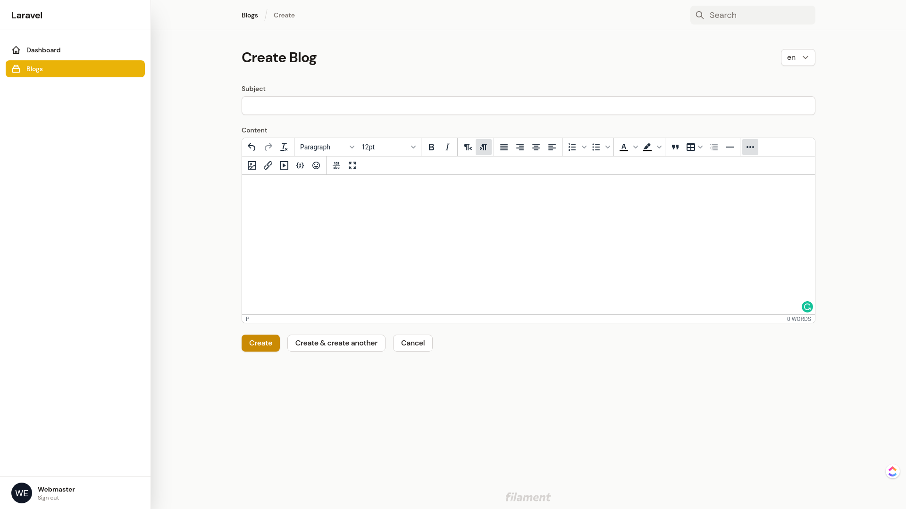
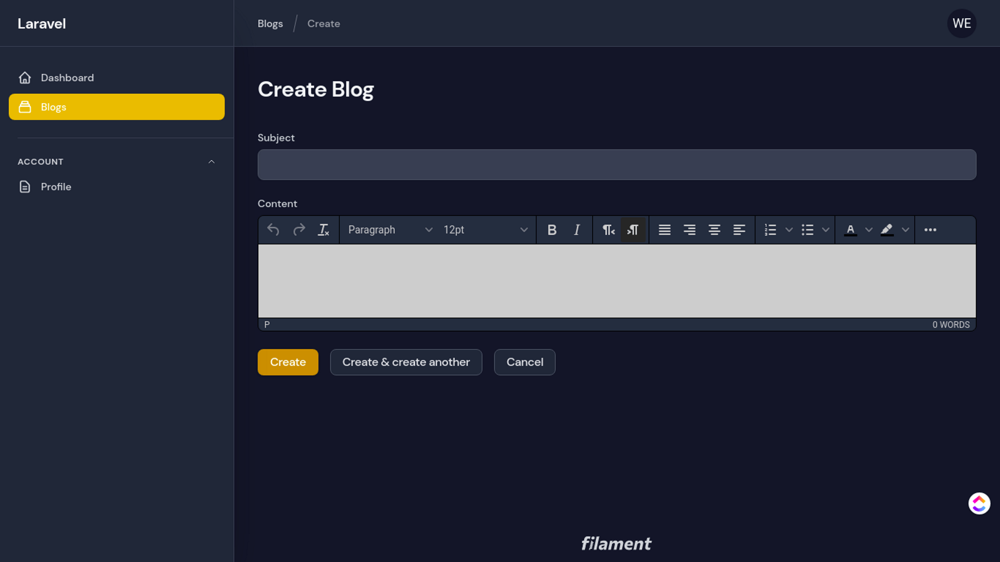

# Filament Forms TinyEditor


[](https://packagist.org/packages/mohamedsabil83/filament-forms-tinyeditor)
[](https://github.com/mohamedsabil83/filament-forms-tinyeditor/actions?query=workflow%3Arun-tests+branch%3Amain)
[](https://github.com/mohamedsabil83/filament-forms-tinyeditor/actions?query=workflow%3A"Check+%26+fix+styling"+branch%3Amain)
[](https://packagist.org/packages/mohamedsabil83/filament-forms-tinyeditor)

Filament Forms TinyEditor is a package for [Laravel Filament](https://github.com/laravel-filament/filament) that wraps [TinyMce Editor](https://www.tiny.cloud) into a usable component. It's works with [Filament Forms](https://filamentadmin.com/docs/2.x/forms/installation) standalone too.

Light mode                           | Dark mode
:-----------------------------------:|:-----------------------------------:
   | 

## Installation

You can install the package via composer:

```bash
composer require mohamedsabil83/filament-forms-tinyeditor
```

Next, publish the asset by run the following:

```bash
php artisan vendor:publish --tag="filament-forms-tinyeditor-assets"
```

## Upgrade

**Sometimes,** you may need to re-publish and override the assets after upgrading:

```bash
php artisan vendor:publish --tag="filament-forms-tinyeditor-assets" --force
```

## Usage

```php
use Mohamedsabil83\FilamentFormsTinyeditor\Components\TinyEditor;

TinyEditor::make('content')
```

## Customiziation

There is some customization that can be applied to the editor.

### **Simple editor**

To use a predefined simple editor, you may use the `simple()` method:

```php
TinyEditor::make('content')->simple()
```

### **Toolbar**

You can add many editors with differnt toolbars for each of them. First, publish the configuration files:

```bash
php artisan vendor:publish --tag="filament-forms-tinyeditor-config"
```

Each profile looks like the following: (You can add as many you want):

```php
'simple' => [
    'plugins' => 'directionality emoticons link wordcount',
    'toolbar' => 'removeformat | bold italic | rtl ltr | link emoticons',
],
```

Then, use each of the profile when adding editor:

```php
TinyEditor::make('content')->profile('your-profile-name')
```

For more information about available plugins and toolbar buttons, visit the related page on the [TinyMCE](https://www.tiny.cloud/docs/advanced/available-toolbar-buttons) site.

### **Custom TinyMCE Config**

By default, tinymce initialized with necessary configs, but if you want to add your config for example `image_advtab: true` ([image_advtab@TinyMce Docs](https://www.tiny.cloud/docs/plugins/opensource/image/#exampleusingimage_advtab)) you can use custom_configs key inside laravel configuration file

You need to convert tinymce json to php array. 

Eg. `image_advtab: true` to `'image_advtab' => true`.

Eg. 
```js
image_class_list: [
    {title: 'None', value: ''},
    {title: 'Fluid', value: 'img-fluid'},
]
```
to
```php
'image_class_list' => [
    [
        'title' => 'None',
        'value' => '',
    ],
    [
        'title' => 'Fluid',
        'value' => 'img-fluid',
    ]
]
```

There is no restriction of configs, you can add everything in here it will be converted and added to tinymce.init() function

```php
// config/filament-forms-tinyeditor.php

'simple' => [
    'plugins' => 'directionality emoticons link wordcount',
    'toolbar' => 'removeformat | bold italic | rtl ltr | link emoticons',
    'custom_configs' => [
        'image_advtab' => true
    ]
],
```

Will be converted and added to javascript directly.
```js
tinymce.init({
    //... all other things
    "image_advtab": true
})
```

### **Editor Height**

By default, the editor will automatically resizes to match the content inside it. If you need to control the height of the editor you can use `->minHeight(int)` method to set the **minimum height** and `->maxHeight(int)` method to set the **maximum height**.

```php
TinyEditor::make('content')->minHeight(300)
```

```php
TinyEditor::make('content')->maxHeight(300)
```

### **Show menubar**

To show the menubar of the editor, use the `->showMenuBar()` method:

```php
TinyEditor::make('content')->showMenuBar()
```

### **Localization**

By default, toolbar button labels shown same as current laravel locale. To force editor to use a specific language, you can use tge `->language()` method:

```php
TinyEditor::make('content')->language('ar')
```

You can found [here](https://github.com/mohamedsabil83/filament-forms-tinyeditor/tree/main/resources/dist/tinymce/langs) a list of all available languages.

## Changelog

Please see [CHANGELOG](CHANGELOG.md) for more information on what has changed recently.

## Contributing

Please see [CONTRIBUTING](.github/CONTRIBUTING.md) for details.

## Security Vulnerabilities

Please review [our security policy](../../security/policy) on how to report security vulnerabilities.

## Credits

-   [MohamedSabil83](https://github.com/mohamedsabil83)
-   [All Contributors](../../contributors)

## License

The MIT License (MIT). Please see [License File](LICENSE.md) for more information.
